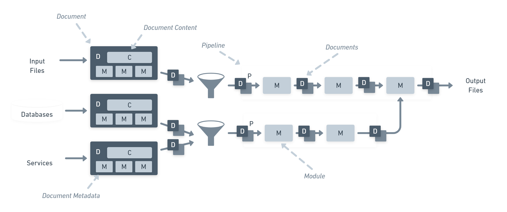

<!-- .slide: data-background-image="https://live.staticflickr.com/65535/49476819197_ce5559e3e6_o.jpg" -->

# Statiq 

## .NET
## static generation platform

by [Laurent Kempé](https://laurentkempe.com)

23 February 2022

<i class="fab fa-twitter"></i> [@laurentkempe](https://twitter.com/laurentkempe) - <i class="fab fa-github"></i> [@laurentkempe](https://github.com/laurentkempe)

---

## What is & why a static site❓

* Serves pre-built HTML, CSS, and JavaScript files <!-- .element: class="fragment" data-fragment-index="1" -->
* Simple, lightweight, fast <!-- .element: class="fragment" data-fragment-index="2" -->
* Flexibility <!-- .element: class="fragment" data-fragment-index="3" -->
* Scalability <!-- .element: class="fragment" data-fragment-index="4" -->
* Security  <!-- .element: class="fragment" data-fragment-index="5" -->
* Cost-efficiency <!-- .element: class="fragment" data-fragment-index="6" -->

---

## Why I move to Statiq ❓

* Porting my blog [laurentkempe.com](https://laurentkempe.com) from [hexo](https://hexo.io/) <i class="fa-brands fa-node-js"></i>
* My **pains** with node <i class="fa-brands fa-node-js"></i> and all npm dependencies
* All updates were difficult and **time-consuming**

&nbsp;

📢️ Will [open source](https://github.com/laurentkempe/StatiqBlog) <i class="fab fa-github"></i> it when it is done!

---

## What is Statiq❓

* Powerful static site generation in .NET
* [Statiq Framework](https://www.statiq.dev/framework/) 

    Build custom static generator application

* [Statiq Web](https://www.statiq.dev/web/)

    Pre-configured and extensible static site generator

* [Statiq Docs](https://www.statiq.dev/docs/)

    Extends Statiq Web for generating .NET API docs

---

## Statiq Web 

* [Data](https://www.statiq.dev/web/content-and-data/data)

  YAML, JSON

* [Templating](https://www.statiq.dev/web/content-and-data/templates/)
 
    Markdown, Razor, Handlebars, HTML

* [Deployment](https://www.statiq.dev/web/deployment/)

    Netlify, Azure App Service, GitHub Pages

---

## How does Statiq work❓

---

# 🚀 DEMO Statiq 

---

# References📘

* [Statiq Website](https://www.statiq.dev/) by [Dave Glick](https://twitter.com/daveaglick) <i class="fab fa-twitter"></i> 
* [Statiq on GitHub](https://github.com/statiqdev)
* [Statiq GitHub Discussions](https://github.com/statiqdev/Discussions/discussions)
* [Statiq <i class="fab fa-twitter"></i>](https://twitter.com/statiqdev)
* [GitHub Pages](https://pages.github.com/)
* [Jamstack Site Generators](https://jamstack.org/generators/)

---

# Thank You! 🚀

<!-- .slide: data-background-image="https://live.staticflickr.com/65535/49476819197_ce5559e3e6_o.jpg" -->

## [Laurent Kempé](https://laurentkempe.com)

<i class="fab fa-twitter"></i> [@laurentkempe](https://twitter.com/laurentkempe) - <i class="fab fa-github"></i> [@laurentkempe](https://github.com/laurentkempe)
